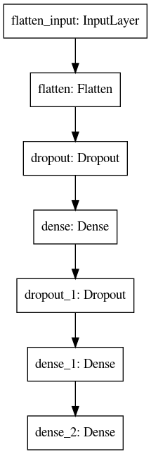

# Predict-Mental-Health-Treatment
Using data science analysis and keras models, we predict whether a person needs mental health treatment based on the given parameters in the 2014 mental health survey data.

## Brief Model Summary
I achieved a 82.8% accuracy on test set with Keras Tuned Feed Forward Neural Network. 

## Model
My Keras generated Model

